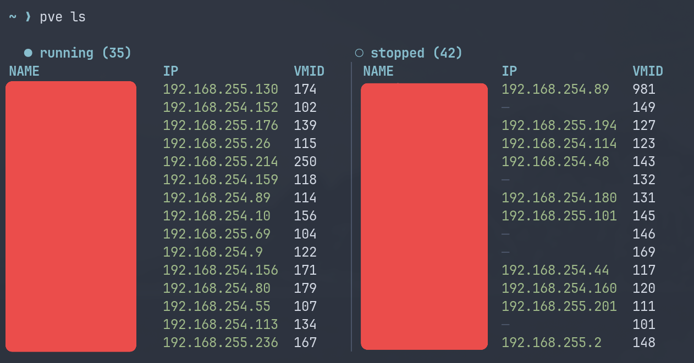
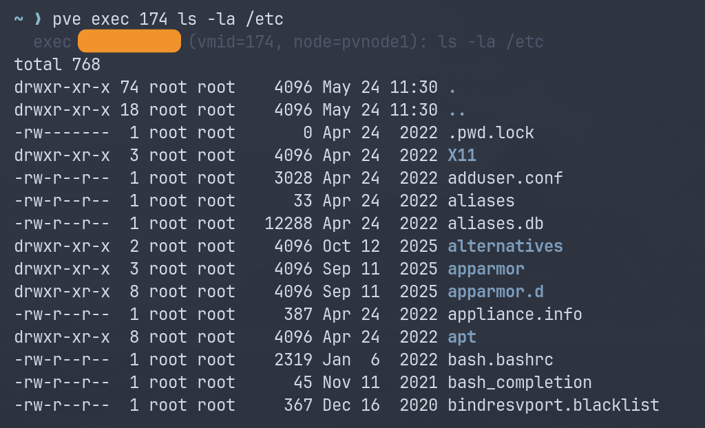
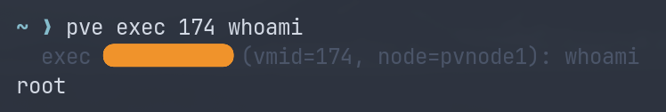
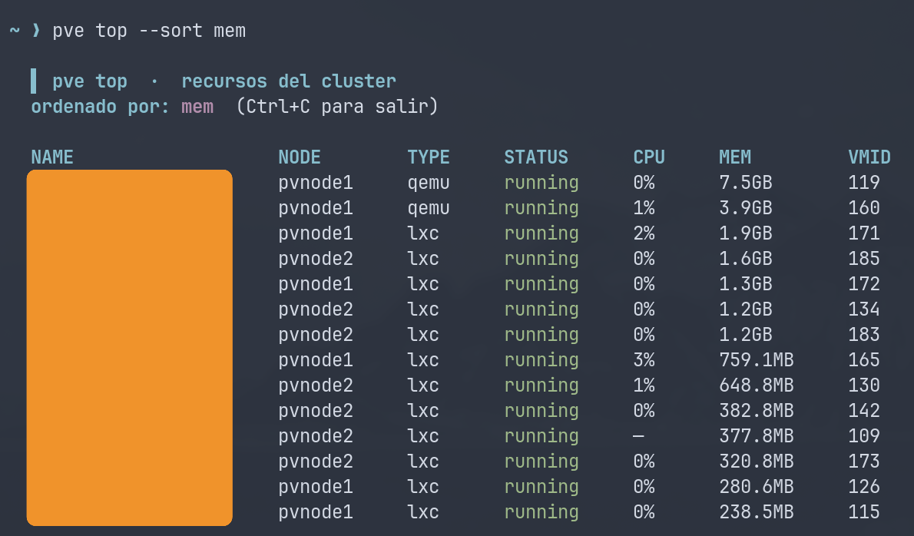
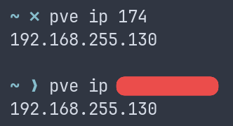

<div align="center">

<p align="center">
  
</p>

**The terminal companion your Proxmox cluster was missing.**

*Tu compañero de terminal que le faltaba a tu cluster Proxmox.*

[](https://go.dev)
[](LICENSE)
[](https://github.com/h4sht/pve/releases/latest)
[](https://github.com/h4sht/pve)

<p align="center">
  <a href="#-english">🇬🇧 English</a> · <a href="#-español">🇪🇸 Español</a>
</p>

<p align="center">
  <a href="#-quick-start">Install</a> · <a href="#-api-token">API Token</a> · <a href="#-español">Instalación</a> · <a href="#-crear-un-token-de-api-de-proxmox">Token API</a>
</p>

</div>

<p align="center">
  
</p>

<p align="center">
  <em>List all your LXCs/VMs, with IPs, from the terminal.</em><br>
  <em>Lista todos tus LXC/VM con sus IPs desde la terminal.</em>
</p>

---

<a id="-english"></a>
# 🇬🇧 English

## Why pve?

You spin up LXCs and VMs every day. Then you open the Proxmox web UI, click through the tree, expand the network tab, and finally find the IP. **Again.**

`pve` brings the cluster back to your terminal:

| Before | After |
|---|---|
| Open browser → login → click Datacenter → node → container → network → IP | `pve ls --ips` |
| Need to restart a container | `pve restart 105` |
| Check resource usage | `pve top` |
| Run a command inside an LXC | `pve exec 105 ls /etc` |

## ✨ Features

<div align="center">

|  | Live dashboard | See every node, LXC and VM at a glance. |
|----|----------------|-----------------------------------------|
| 🔍 | Fuzzy search | Find containers by name, VMID or IP. |
| 🌐 | IP resolution | API, static config, live interfaces or tags. |
| 🖥️ | Remote exec | Run commands inside any LXC. |
| ⏯️ | Power control | Start, stop and restart in one command. |
| 📊 | Resource monitor | `top`-style live view of your cluster. |
| 🌍 | Bilingual | English or Spanish. |
| 🔄 | Auto-updates | Built-in self-update from GitHub Releases. |

</div>

## 🚀 Quick start

```bash
# One-line install
curl -fsSL https://raw.githubusercontent.com/h4sht/pve/main/scripts/install.sh | bash -s -- \
  --repo h4sht/pve \
  --nodes "10.0.0.10,10.0.0.11" \
  --token "PVEAPIToken=root@pam!pve-cli=YOUR-SECRET-UUID"
```

Or build from source:

```bash
git clone https://github.com/h4sht/pve.git
cd pve
go build -o pve ./cmd/pv/
sudo mv pve /usr/local/bin/
```

## ️ Configure

```bash
pve config nodes 10.0.0.10,10.0.0.11
pve config token 'PVEAPIToken=root@pam!pve-cli=<your-secret-uuid>'
pve config lang es          # optional: switch to Spanish
```

Configuration lives in `~/.config/pve/config.json` with permissions `0600`.

## 📸 See it in action

| `pve ls --ips` | `pve exec` |
|---|---|
|  |  |

| Inside a container | `pve top` live view |
|---|---|
|  |  |

| `pve ip` quick lookup |
|---|
|  |

## 🔑 Create an Proxmox API token

1. Proxmox web UI → **Datacenter → Permissions → API Tokens → Add**.
2. User: `root@pam`, Token ID: `pve-cli`.
3. Uncheck **Privilege Separation** or assign a role with these permissions: `VM.Audit`, `VM.Monitor`, `VM.PowerMgmt`.
4. Copy the full token and pass it to `pve config token`.

##  License

[MIT](LICENSE) © h4sht

---

<a id="-español"></a>
# 🇪🇸 Español

## ¿Por qué pve?

A diario lanzas LXC y VM. Luego abres la web de Proxmox, navegas por el árbol, expandes la pestaña de red y, al final, encuentras la IP. **Otra vez.**

`pve` devuelve el control a tu terminal:

| Antes | Después |
|---|---|
| Abrir navegador → login → Datacenter → nodo → contenedor → red → IP | `pve ls --ips` |
| Reiniciar un contenedor | `pve restart 105` |
| Ver consumo de recursos | `pve top` |
| Ejecutar un comando dentro de un LXC | `pve exec 105 ls /etc` |

## ✨ Características

<div align="center">

| ⚡ | Dashboard en vivo | Nodos, LXC y VM de un vistazo. |
|----|-------------------|-------------------------------|
| 🔍 | Búsqueda difusa | Encuentra contenedores por nombre, VMID o IP. |
| 🌐 | Resolución de IP | API, config estática, interfaces o tags. |
| 🖥️ | Ejecución remota | Corre comandos dentro de cualquier LXC. |
| ️ | Control de energía | Arranca, para y reinicia con un comando. |
| 📊 | Monitor de recursos | Vista estilo `top` de tu cluster. |
| 🌍 | Bilingüe | Inglés o español. |
| 🔄 | Auto-actualización | Actualización desde GitHub Releases. |

</div>

## 🚀 Inicio rápido

```bash
# Instalación en una línea
curl -fsSL https://raw.githubusercontent.com/h4sht/pve/main/scripts/install.sh | bash -s -- \
  --repo h4sht/pve \
  --nodes "10.0.0.10,10.0.0.11" \
  --token "PVEAPIToken=root@pam!pve-cli=TU-UUID-SECRETO"
```

O compila desde fuente:

```bash
git clone https://github.com/h4sht/pve.git
cd pve
go build -o pve ./cmd/pv/
sudo mv pve /usr/local/bin/
```

## ⚙️ Configurar

```bash
pve config nodes 10.0.0.10,10.0.0.11
pve config token 'PVEAPIToken=root@pam!pve-cli=<tu-uuid-secreto>'
pve config lang es          # opcional: cambiar a español
```

La configuración se guarda en `~/.config/pve/config.json` con permisos `0600`.

## 📸 Vélo en acción

| `pve ls --ips` | `pve exec` |
|---|---|
|  |  |

| Dentro del contenedor | `pve top` en vivo |
|---|---|
|  |  |

| `pve ip` búsqueda rápida |
|---|
|  |

## 🔑 Crear un token de API de Proxmox

1. Web de Proxmox → **Datacenter → Permissions → API Tokens → Add**.
2. Usuario: `root@pam`, ID de token: `pve-cli`.
3. Desmarca **Privilege Separation** o asigna un rol con estos permisos: `VM.Audit`, `VM.Monitor`, `VM.PowerMgmt`.
4. Copia el token completo y pásalo a `pve config token`.

## 📜 Licencia

[MIT](LICENSE) © h4sht
